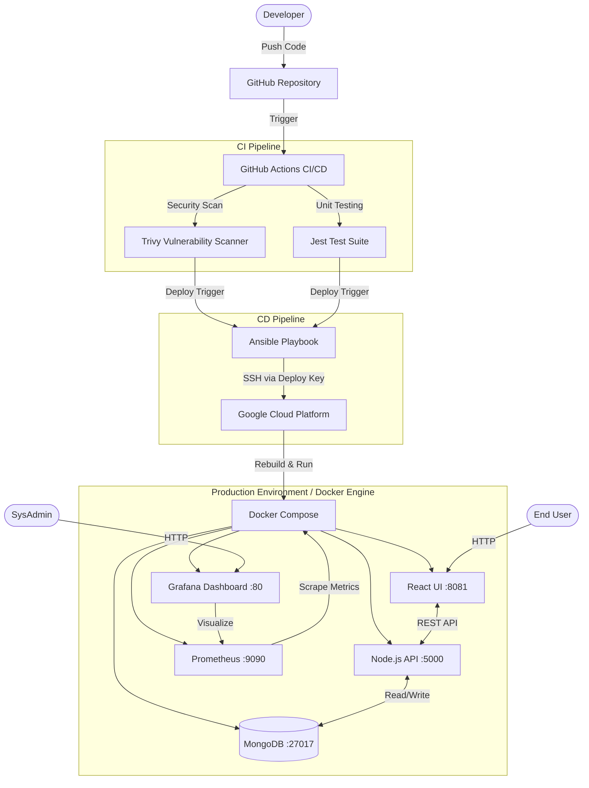

# 🎓 Enterprise Cloud Attendance System


[](https://cloud.google.com/)
[](https://www.ansible.com/)
[](https://grafana.com/)

**Enterprise Cloud Attendance System** is a production-ready, full-stack student attendance tracking portal engineered with a complete, modern Site Reliability Engineering (SRE) and DevOps lifecycle. It transcends traditional college projects by implementing automated zero-downtime deployments, strict containerization, and real-time infrastructure observability.

---

## 🚀 Key Features

- **Full-Stack MERN Architecture**: A robust React frontend communicating seamlessly with a fast Node.js/Express REST API and a persistent MongoDB database.
- **Zero-Touch CI/CD Pipeline**: Fully automated integration and deployment via **GitHub Actions**. Code pushed to the `main` branch is instantly tested, scanned, and deployed.
- **Automated Configuration Management**: Utilizes **Ansible** to securely SSH into the cloud environment, verify dependencies, pull the latest codebase, and orchestrate the containers immutably.
- **Containerized Microservices**: The entire application (Frontend, Backend, Database, and Monitoring) is containerized using **Docker** and managed via **Docker Compose** for guaranteed parity between local and production environments.
- **Real-Time Observability Stack**: Integrated **Prometheus** for scraping hardware and container metrics, visualized through a customized **Grafana** dashboard tracking CPU, memory, and uptime.
- **Continuous Security**: Built-in **Trivy** vulnerability scanning within the pipeline to ensure Docker images are free of critical CVEs before deployment.
- **Automated Testing**: Integrated **Jest** testing suite to continuously validate backend API logic and health checks.

---

## 🏗️ Architecture & Deployment Flow



---

## 🛠️ Technology Stack

| Layer | Technologies Used | Key Purpose |
| :--- | :--- | :--- |
| **Frontend** | **React.js** | Dynamic, component-based user interface. |
| **Backend** | **Node.js + Express** | High-performance asynchronous REST API. |
| **Database** | **MongoDB** | NoSQL database for flexible student/attendance data storage. |
| **Containerization** | **Docker & Compose** | Ensures consistent environments across dev, test, and production. |
| **CI/CD** | **GitHub Actions** | Automates the build, test, and deployment lifecycle. |
| **Config Management** | **Ansible** | Idempotent server configuration and automated application startup. |
| **Cloud Hosting** | **Google Cloud (GCP)** | Scalable compute instance with custom firewall rules. |
| **Monitoring** | **Prometheus + Grafana** | Real-time system health and performance observability. |
| **Testing & Security** | **Jest + Trivy** | Backend unit validation and container vulnerability scanning. |

---

## ⚙️ Setup & Installation

### Local Development Setup
1. **Clone the repository:**
   ```bash
   git clone https://github.com/debjitghosal/attendance_tracker.git
   cd attendance_tracker
   ```

2. **Spin up the local development environment:**
   Ensure Docker is installed, then run:
   ```bash
   docker compose up -d --build
   ```

3. **Access Local Services:**
   - App Frontend: `http://localhost:8081`
   - Grafana Dashboard: `http://localhost:80`
   - Prometheus Targets: `http://localhost:9090`

### Cloud Deployment (Ansible)
To manually trigger a deployment to the production server via Ansible:
1. Ensure Ansible is installed on your local control node.
2. Place your private SSH key (`deploy_key`) in the root directory.
3. Run the playbook:
   ```bash
   ansible-playbook -i "<SERVER_IP>," -u ubuntu --private-key ./deploy_key ansible/deploy.yml
   ```

---

## 🛡️ Security & Testing Practices

- **Test-Driven Architecture**: The backend logic is continuously verified by **Jest**. Tests act as a gatekeeper in the CI pipeline; if a test fails, the deployment is halted.
- **Shift-Left Security**: The **Trivy** scanner analyzes the Docker images during the GitHub Action workflow. High or Critical vulnerabilities are flagged instantly.
- **Principle of Least Privilege**: The production server only opens essential ports (80, 8081, 5000, 3005) configured via strict GCP Firewall rules. State files and SSH keys are explicitly ignored by `.gitignore` to prevent secret leaks.
